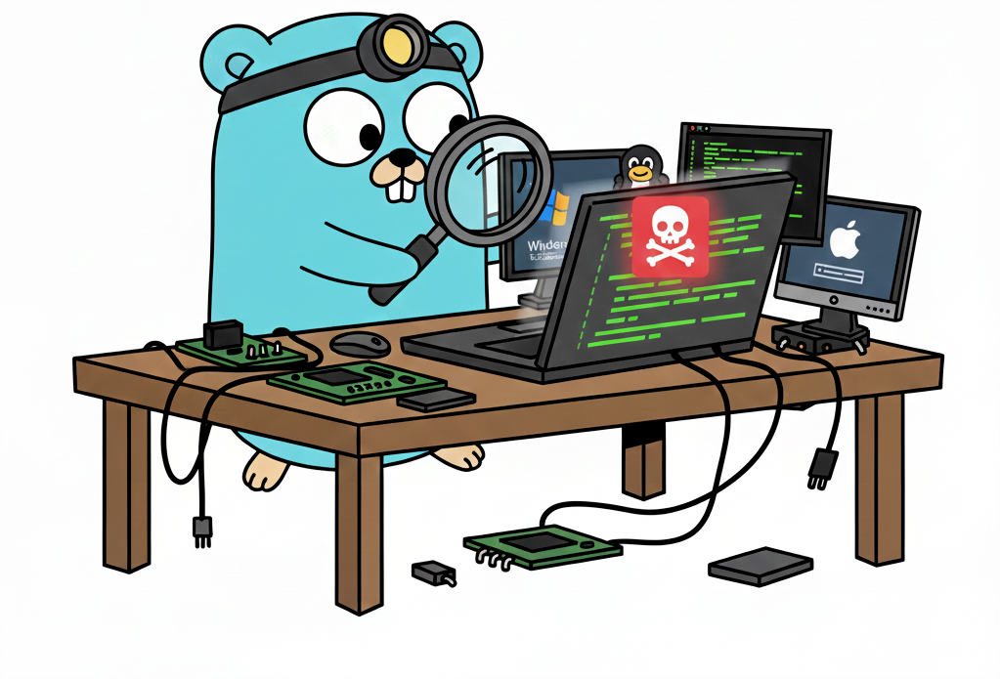

# ssdt-scanner
SSDT (System Service Descriptor Table) scanner for any milicous activities!

<p align="center">
  
</p>

A Defensive Tool for Detecting Kernel-Mode Tampering on Windows

## Requirements
```bash
sudo apt-get install clamav clamav-daemon
```

## Overview

The System Service Dispatch Table (SSDT) is a critical kernel structure in Windows.
It contains pointers to system call handler functions—for example:

- NtCreateFile
- NtOpenProcess
- NtQuerySystemInformation

Because SSDT controls how system calls reach the kernel, malicious drivers sometimes attempt to hijack entries in the table to intercept or manipulate Windows behavior.

An SSDT scanner is a security tool designed to detect kernel-level tampering, such as:

- Hooking (changing system call function pointers)
- Redirecting calls to malicious code
- Rootkit-style stealth techniques

This type of scanning is widely used in:

- EDR products
- Anti-rootkit tools
- Incident response

---
## What the Scanner Checks
An SSDT scanner performs read-only analysis of kernel structures to look for anomalies.

### Typical Checks (High-Level)

1. Integrity of SSDT entries

- Compare current SSDT function pointers with known-good kernel image addresses.
- Flag entries pointing to unknown or non-kernel memory regions.

2. Detection of hooks

- Identify function pointers that fall outside legitimate kernel modules.
- Check for inline patches (code overwrites) in system-call handlers.

3. Module validation

- Verify whether the module providing the hooked address is signed/trusted.
- Detect hidden or manually mapped drivers.

4. Unexpected changes to system call count
- Some rootkits alter the number of entries in the SSDT.

5. Cross-checking with kernel exports
- Compare SSDT-resolved functions with their expected entry points.

Note: This scanner does not modify the system or attempt repair.
It is strictly a detection-only mechanism.
---

## How This Helps Detect Malware

Many kernel-level malware families (rootkits, keyloggers, stealth backdoors) modify SSDT entries to intercept privileged operations.

An SSDT scanner can detect:

- System-call redirection to malicious handlers
- Untrusted unsigned drivers hooked into the kernel
- Hidden code modules modifying kernel dispatch tables
- Kernel tampering techniques used by older rootkits (e.g., SSDT hooking, inline patching)

This allows defenders to:

- Identify compromised hosts
- Collect forensic evidence
- Respond to kernel-level threats
---

## Tool
The tool on the Linux side will scan the SSDT table and run the ClamAV antivirus on the investigated path that can have the malware. The tool will update the database for the ClamAV locally. It will run a full scan asynchronously for double validation.

---
## TODO:
- Adding windows scanner.
- Adding MacOS scanner.